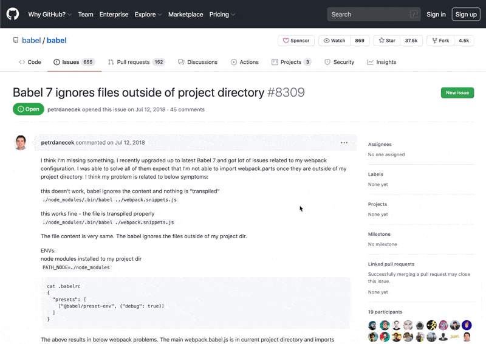
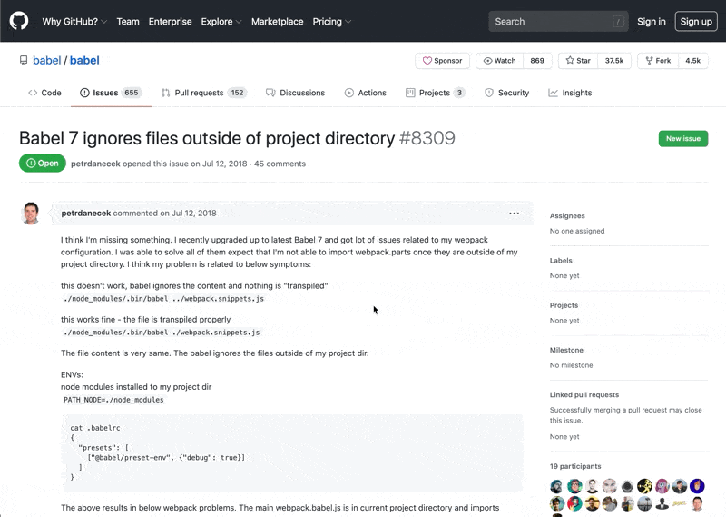
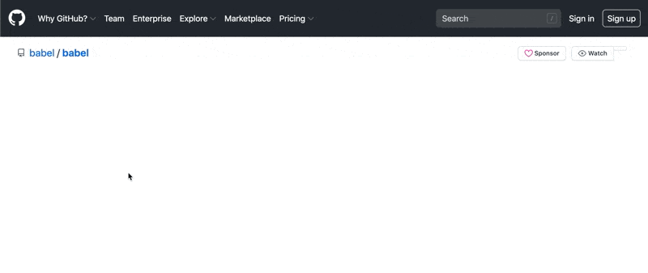

# GitHub Reference Aggregator
_A Chrome extension that makes it easy to find all of an issue's references._

## Installation

[Add to Chrome](https://chrome.google.com/webstore/detail/github-reference-aggregat/jikhppmpafhplndfedldogehgpjiiekm)

After adding to Chrome you'll need to add a personal access token with the `repo` scope to GRA via its extension options.

For more information on how to generate your token, please visit the [GitHub help docs](https://docs.github.com/en/free-pro-team@latest/github/authenticating-to-github/creating-a-personal-access-token).

## 🤔 Why?

Sometimes finding references to the issue you're currently viewing can be tough:

## 😮 So what does this do to help?

When an issue has been referenced, all of its references will be aggregated at the bottom of its description in a convenient little `
` block:

## 👀 Let's see that again:

When the issue loads, GitHub Reference Aggregator fetches all of the references made to it. When it finds any references, it adds a `
` block with all of those references to the bottom of the issue's description:

## 👾 Developing

1. Clone this repo
2. Run `npm install`
3. Make your changes
4. Run `npm run build`
    - _You can also run `npm run watch` if you'd like to recompile on every save_
5. In Chrome, navigate to `chrome://extensions/`
6. Select "Load unpacked"
    - _If you don't see this option, you may need to enable "Developer mode"_
7. Select the folder where you cloned this repo

💡 Don't forget to recompile the project and reload the extension when you make any subsequent changes.
